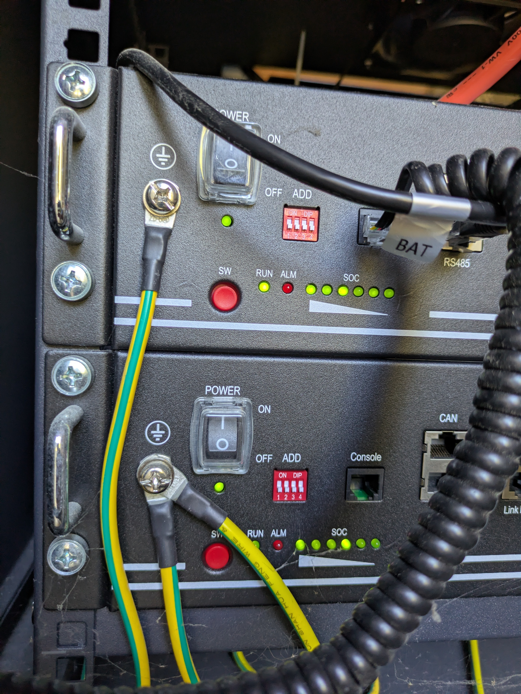

# Pylontech Serial Integration for Home Assistant

Connect your Pylontech US2000/US3000 battery stack directly to Home Assistant using a USB-to-RS232/RS485 cable.

## Features
- **Direct Serial Connection**: Reads battery data directly from the Console port.
- **Home Assistant Native**: No MQTT or Docker containers required.
- **Energy Dashboard Ready**: Includes calculated Energy (kWh) sensors for proper dashboard Integration.
- **Per-Battery Monitoring**: Voltage, Current, SOC, Temperature, and Status for each module.

> [!NOTE]
> **USB Auto-Discovery**: Currently, **only** the Prolic PL2303 scanner (VID `067B`, PID `2303`) is supported for auto-discovery. If you have a different adapter, it will not be automatically detected, but you can still manually select the port during configuration.
>
> To add auto-discovery support for your device, please see [CONTRIBUTING.md](CONTRIBUTING.md).

## Installation

### Via HACS (Recommended)

1.  Ensure you have [HACS](https://hacs.xyz/) installed.
2.  Go to **HACS > Integrations**.
3.  Click the **3 dots** (top right) > **Custom repositories**.
4.  Add the URL of this repository.
5.  Category: **Integration**.
6.  Click **Add**, then find and install **Pylontech Serial**.
7.  Restart Home Assistant.

### Manual Installation

1. **Locate your configuration directory**: Find your Home Assistant `config` folder (where `configuration.yaml` lives).
2. **Create custom_components**: If it doesn't exist, create a folder named `custom_components` inside your `config` folder.
3. **Copy files**: Copy the `pylontech_serial` folder from `custom_components/` in this repository to your Home Assistant's `custom_components/` folder.
   - Resulting path: `/config/custom_components/pylontech_serial/`
4. **Restart Home Assistant**: This is crucial for HA to recognize the new component.

## Configuration

1. Connect your Pylontech battery to the machine running Home Assistant via USB.
2. In Home Assistant, go to **Settings** > **Devices & Services**.
3. Click **+ ADD INTEGRATION** in the bottom right.
4. Search for **Pylontech Serial**.
5. Select your Serial Port from the list.
6. Configure the Baud Rate (Default 115200) and Battery Capacity (Default 2.4 kWh per module) if needed.
7. Click **Submit**.

### Hardware Configuration
Ensure your battery DIP switches are configured correctly for communication. For US2000/US3000, **all DIP switches OFF** selects the default baud rate of **115200**.

*Pylontech US2000 with all DIP switches OFF*

## Energy Dashboard Setup

To track your battery usage in the Energy Dashboard:

1. Go to **Settings** > **Dashboards** > **Energy**.
2. Find the **Battery Systems** section and click **Add Battery System**.
3. For **Energy going in to the battery**, select: `sensor.pylontech_stack_system_energy_charged`
4. For **Energy coming out of the battery**, select: `sensor.pylontech_stack_system_energy_discharged`
5. Click **Save**.

## Troubleshooting
- **No data?**: Check that the correct serial port is selected and that the cable is plugged into the **Console** port of the Master battery (not CAN/RS485 unless using a specific adapter).
- **Permissions**: If running Home Assistant Core in Docker (not OS), ensure the device is passed through (`--device /dev/ttyUSB0`).
